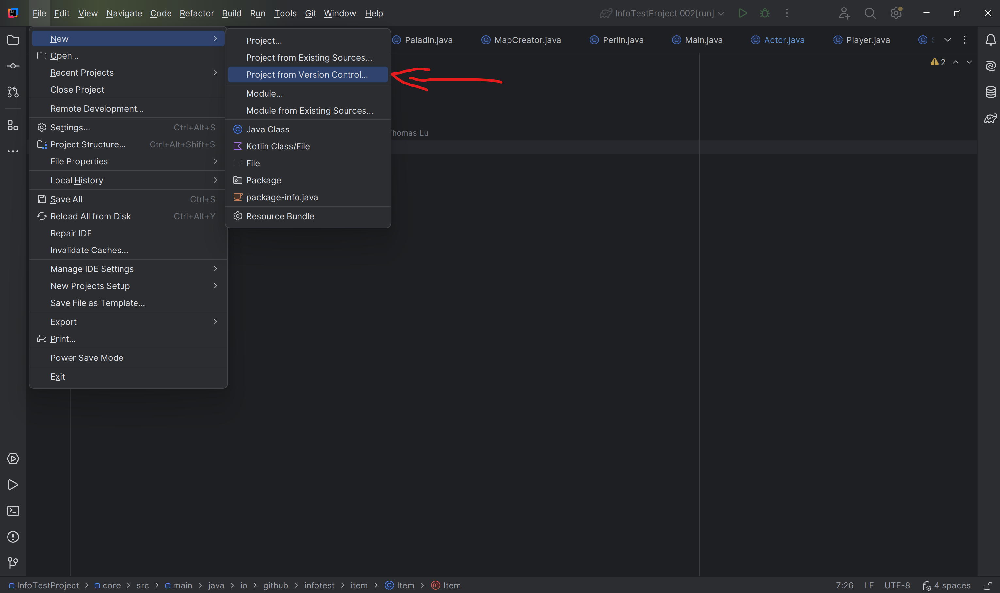
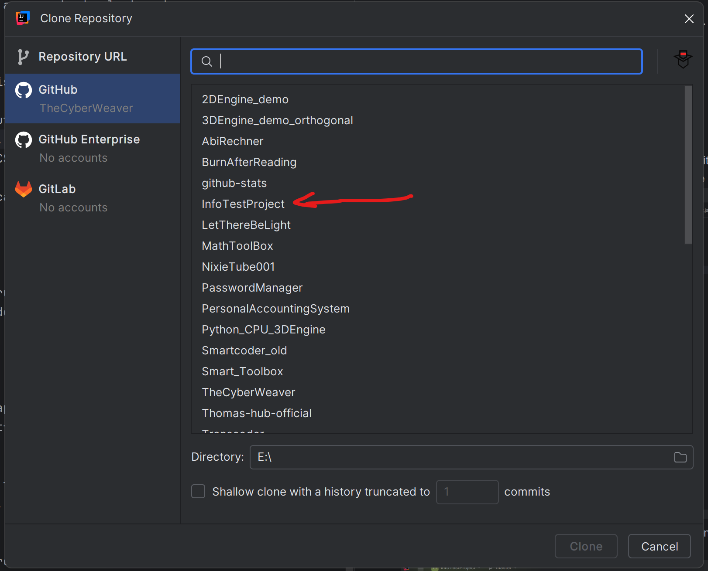
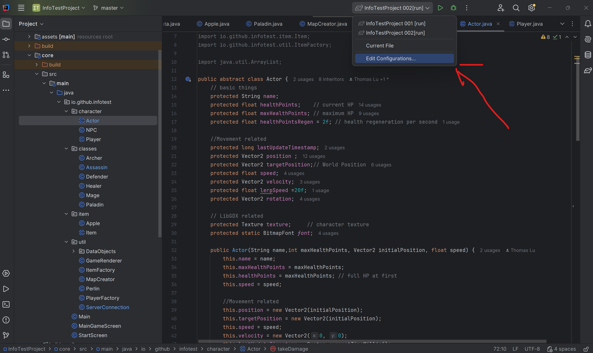
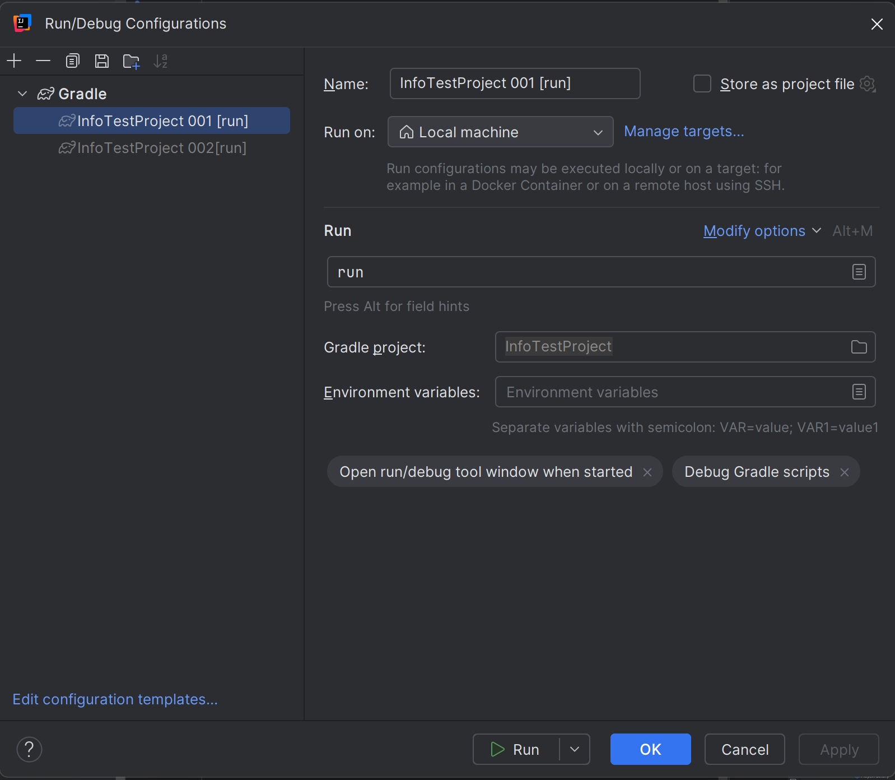

# Become A Endless Fighter

A student project made by the members of Info class of Privates Gymnasium Schloss Torgelow
## Project Demo

## Install the Game

Coming Soon in Release page. We are now in developing phase.

## Setting Up for Contributors
If you want to contribute to this project:

- Email us and become a contributor (3318193092@qq.com).
- Install and open IntelliJ IDE. (You can use your own code editor, as long as you are familiar with Git)
- In tab **Getting Start with VCS**.

- Login with your GitHub account. You should be able to see the name of this project

- Clone this project to your local device following the instructions from IntelliJ.
- Click on Edit Configuration.

- Configure as the followings.

- Congratulations, now you can run and test the game as you want. (click the green triangle on the top right of the screen to run the program)
- We suggest committing your code into a separate branch.

## Platforms

- `core`: Main module with the application logic shared by all platforms.
- `lwjgl3`: Primary desktop platform using LWJGL3; was called 'desktop' in older docs.

## Gradle
This project uses [Gradle](https://gradle.org/) to manage dependencies.
The Gradle wrapper was included, so you can run Gradle tasks using `gradlew.bat` or `./gradlew` commands.
Useful Gradle tasks and flags:

- `build`: builds sources and archives of every project.
- `lwjgl3:jar`: builds application's runnable jar, which can be found at `lwjgl3/build/libs`.
- `lwjgl3:run`: starts the application. (<- Use this one)
